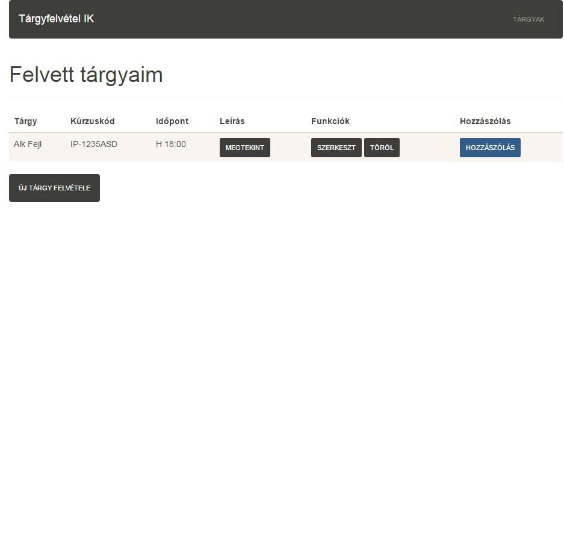

Dokumentáció

Alkalmazások fejlesztése beadandó 3

Készítette: Szabó Ádám - PSFKRI

1.1 Követelményanalízis

A projekt (beadandó) célja egy webes vastagkliens, azaz egyoldalas alkalmazás készízése Ember.js segítségével, szerveroldalon REST API használatával és az adatok perzisztálásával.
    Az alkalmazást a Tantárgyak felvétele példát valósítaná meg. Az alkalmazás alapja egy olyan weblap, ahol egy listába megtalálhatóak a felvett tantárgyak.
    A felvett tárgyakhoz ezután megjeyzéseket lehet fűzni.

I. Funkcionális követelmények:

  1. szeretnék felvenni egy tárgyat -> tárgy felvétele,
  2. felvett tárgyak megtekintése -> tárgyak listázása,
  3. szeretnék egy tárgyat szerkeszteni -> tárgy szerkesztése,
  4. szeretnék egy tárgyat törölni -> tárgy törlése,
  5. tárgyhoz hozzászólás fűzése -> hozzászólás,
  6. a tárgyhoz tartozó adatok, hozzászólások megtekintése -> tárgy megtekintése

II. Nem funkcionális követelmények:

  1. felhasználóbarát,
  2. gyors működés,

1.2.Szakterületi fogalomjegyzék

   Webes vastagkliens - *egyoldalas webes alkalmazás*
   REST API végpont - *Representational State Transfer (REST) Application Programming Interface (API)*

1.3. Használatieset-modell

I. Használati esetek:
  A felhasználó megtekintheti a már felvett tárgyak listáját. Ha az nem üres, akkor már tudja a lista egyes elemeit szerkeszteni és   törölni, hozzászólásokat fűzni hozzájuk. Új tárgyak felvételére is van lehetőségünk.

III. Egy folyamat kifejtése

  1. Megjelenik a főoldalt
  2. Menüből a Tárgyak gombbal eljutunk a listához
  3. Egy új tárgy felvétele

  

Tervezés

2.1. Architektúra terv

I. Oldaltérkép

  - Főoldal
  - Tárgyak listája
    - Új tárgy felvétele
    - Tárgy törlése
    - Tárgy szerkesztése
    - Hozzászólás írása a tárgyhoz
    - Tárgy megtekintése
    
II. Végpontok

  - / : főoldal
- /errors/list : tárgytlista
- /errors/view/:error_id : tárgy adatai
- /errors/edit/:error_id : tárgy adatainak módosítása
- /errors/comments/new/:error_id : hozzászólás írása

2.2. Felhasználóifelület-modell

  I. Oldalvázlatok, Designterv
        
      - 
      - 
      - 
      - 
      - 
      - 
        
2.3 Osztálymodell
    
    I. Adatmodell
   
       
    
    II. Adatbázisterv
   
       
    
Implementáció

3.1. Fejlesztői környezet bemutatása

   A program fejlesztése során az alábbi fejlesztői környezeteket használtam:
   - gitHub - a gitHub biztosítja a tárhelyet az alkalmazásnak
   - cloud9 IDE - a kódolás törtönt itt

3.2. Könyvtárstruktúrában lévő mappák funkciójának bemutatása

  Kliensoldalon az "app" mappa tartalmazza a kliensoldalhoz szükséges összes fájlt, valamint tartalmaz több almappát is, amelyek az alábbiak:

1. A "pods/application" mappa tartalmazza az aktuális applikációt.

2, A "pods/comment" mappa tartalmazza a hozzászólások modeljét

2. A "pods/components" mappa tartalmazza az Ember.js által generált, majd bővített komponenseket, melyek név szerint vannak almappába rendezve:

2.1.  "error-detail": a tárgyak adatait megjelenítő template.

2.2.  "error-list" : a listázóoldal táblázatát tartalmazó template.

2.3.  "modal-dialog" :a felugróablak (modal).

2.4.  "new-comment-form": az új ablakba kitöltendő kérdőív (form).

2.5.  "new-comment-modal": a kommentekhez tartoző új ablak.

2.6.  "new-error-form":  a felugróablakba betöltendő kérdőív (form).

2.7.  "new-error-modal": a tárgy felvételéhez tartozó felugróablak (modal).

3. Az "error" mappa tartalmazza a tárgyak modelljét.

4. A "errors" mappa tartalmazza a fent felsoroltak controllereit tartalmazó mappákat, név szerint:

4.1. "comments/new": az új hozzászólás írásához használt blokk, a "new-comment-form" template-et használja,

4.2. "edit": a szerkesztéshez használt blokk, a "new-error-form" template-et használja,

4.3. "list": a listázóoldal keretének template-je, a "error-list" template-et használja, ez a modal miatt egyben használja a "modal-dialog" és a "new-error-form" template-eket is,

4.4.  "new": az új tárgy felvételéhez használt blokk, a "new-error-from" template-et használja, 

4.5. "view": a "error-detail" template-et használó controllet mappája.

5. Az "index"  a főoldalt tartalmazó template.,

A "docs" mappa "images" almappája tárolja a jelen dokumentációban szereplő képeket, míg a "dist/assets" mappa a HTML tartalom megjelenítéséhez szükséges bootstrap, bootswatch és js/jquery fájlokat tartalmazza.

Szerveroldalon a ".db" mappa az adatbázis tárolására hivatott, míg a gyökérmappában lévő server.js hivatott az adatbáziskezelő szerver létrehozására.

Tesztelés

A tesztelés során kézzel teszteltem mindent, mivel kevés funkciója van az elkészített weboldalnak, és nem okozott nagy gondot vagy időkiesést.
Tesztelt esetek:

1. új tárgy létrehozása: az "Új tárgy felvétele" gombra való kattintásra az elvártnak megfelelően felugrik a "new-error-form" modal ablak, amely bekéri az adatokat. Hiányos adatok esetén jelzi a problémát, és nem enged új tárgyat hozzáadni, amíg a problémát meg nem oldjuk. Ezután a "Submit" gomb lenyomása után a modal ablak bezárul, a létrehozott tárgy pedig megjelenik a listázó oldalon.

2. tárgy szerkesztése: a listázóoldal megfelelő sorában a "Szerkeszt" gombra kattintva az elvártaknak megfelelően megjelenik a "new-error-form" modal, amelybe már be vannak töltve a tárgy adatai. Módosítani lehet mindhárom mezőt.

3. tárgy megtekintése (ID-t is mutatja): a listázóoldal megfelelő sorában a "Megtekint" gombra kattintva az elvártaknak megfelelően megjelenik a megtekinteni kívánt tárgy minden adata: ID, tárgynév, időpont, kurzuskód és a hozzászólások (a név és az üzeent). A "Vissza" gombra kattintva visszakerülünk a listázóoldalra.

4. tárgy törtlése az adatbázisból: a listázóoldal megfelelő sorában a "Töröl" gombra kattintva az elvártaknak megfelelően törlődik az adatbázisból is a megjelenítési listából is a törölni kívánt elem.

5. hozzászólás írása: a "hozzászólás" gomba kattintás után megjelenik a "new-comment-form" modal amely bekéri az adatokat. Hiányos adatok esetén jelzi a problémát, és nem enged új hozzászólást írni, amíg a problémát meg nem oldjuk. Ezután a "Submit" gomb lenyomása után a modal ablak bezárul, a hozzászólás pedig hozzáadoidik a tárgyhoz.

Felhasználói dokumentáció

  A program futtatásához elegendő egy modern böngésző (IE 9+, Google Chrome, Mozilla Firefox, Opera, Safari) és a cloud9 rendszer (node.js).

A program használata egyszerű: a szerver felállása után a kliensoldalon keresztül a felhasználó meglátogatja a főoldalt, ahol rövid leírást olvashat a honlap lényegéről.

Utána a menüben lévő "Tárgyak" menüpontra kattintva betöltődik a tárgyak listája. Ha már van tárgy a táblázatban, akkor a felhasználó továbbra is felvehet új tárgyat, viszont szerkesztheti, megtekintheti, törölheti vagy akár hozzá is szólhat a táblázat megfelelő sorában a megfelelő gombra kattintva, amelyek sorban az alábbiak:

1. Megtekint: tárgy részleteinek megtekintése

2. szerkeszt: tárgy szerkesztése

3. Delete: tárgy törlése.

4. Hozzászólás: hozzászólás írása a tárgyhoz
  
  4.1. Név: a felhasználó neve aki a hozzászólást írta.

  4.2 Hozzászólás: maga a hozzászólás.
  
Ha üres a táblázat, a felhasználó hozzáadhat új tárgyat, de mást nem tud tenni. Új tárgy felvételéhez az "Új tárgy felvétele" feliratú gombra kell kattintania, majd a felugró ablakban kitölteni a megfelelő mezőket, amelyek az alábbiak:

1. Tárgynév: a tárgy neve pl. Alkalmazások fejlesztése

2. Kurzuskód: a tárgyhoz tartozó kurzusnak a kódja pl. IP-08CALKG

3. Időpont: a tárgy időpontja pl. H: 14:00

Minden egyes, a felületen végzett változtatás eredménye megjelenik a táblázatban, így a felhasználó azonnali visszaigazolást kap arról, ami a háttérben az adatbázisban történik.

